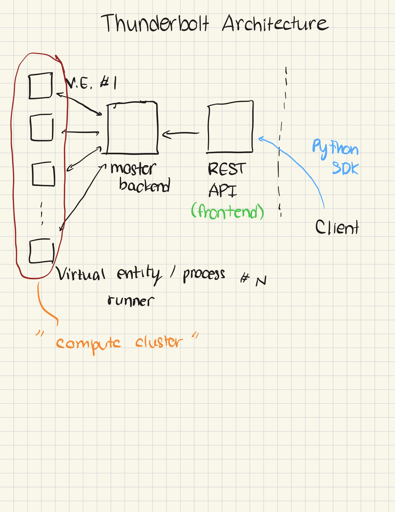

# Thunderbolt: A simple, drop-in distributed micro protocol for implementing remote execution

Thunderbolt is a fast-prototyped API that can be leveraged for setting up remote execution across a large pool of nodes. In practice, this may be a fundamental building block for tackling problems such as cluster resiliency. 

This project exposes a simple FastAPI routes interface that can be easily tacked on to larger services, and a super simple Python client wrapper that can be used to remotely run commands across large numbers of nodes in parallel. 

## Quickstart 

Here's a short code snippet that should give you an idea of how a client user may access Thunderbolt for remote execution via its Python SDK.

```python
from thunderbolt import ThunderBoltAPI

# Quick start - run commands across your cluster
# This assumes you have a thunderbolt master running on port 8000 and serving the API on 8001
with ThunderBoltAPI(host="localhost", port=8001) as api:
    # See what's connected
    nodes = api.list_nodes()
    print(f"📡 {nodes['total']} nodes online")
    
    # Run a command everywhere
    result = api.run_on_all_nodes("nvidia-smi --query-gpu=name --format=csv,noheader")
    for host, res in result['results'].items():
        if res['status'] == 'success':
            print(f"  ✓ {host}: {res['stdout'].strip()}")
    
    # Or target specific nodes
    result = api.run_command(
        command="df -h /workspace",
        nodes=["node-01", "node-02"],
        timeout=10
    )
```

## Setup 

### Installation

```bash
# Clone the repository
git clone https://github.com/yourusername/thunderbolt.git
cd thunderbolt

# Install the package
pip install -e .
```

### Running the Master Node

```python
from thunderbolt import ThunderBoltMaster

# Standalone mode
master = ThunderBoltMaster(port=8000)
master.run()  # API will be available on port 8001
```

Or integrate into your existing FastAPI app:

```python
from fastapi import FastAPI
from thunderbolt import ThunderBoltMaster
from contextlib import asynccontextmanager

# Create master without its own app
master = ThunderBoltMaster(port=8000, no_app=True)

@asynccontextmanager
async def lifespan(app: FastAPI):
    # Start ThunderBolt background tasks
    master.start_background_tasks()
    yield

# Your own FastAPI app
app = FastAPI(lifespan=lifespan)

# Include ThunderBolt routes
app.include_router(master.router, prefix="/thunderbolt")
```

### Running Slave Nodes

```python
from thunderbolt import ThunderBoltSlave

# Connect to master
slave = ThunderBoltSlave(
    master_ip="localhost",
    port=8000,
    hostname="node-01"  # Optional, defaults to system hostname
)
slave.run()
```

Or via command line:

```bash
export MASTER_IP=10.0.0.1
export PORT=8000
python -m thunderbolt.slave
```

## Architecture

Thunderbolt follows the *master-slave* architecture, with 1 slave node per virtual entity - that's a node, docker container, etc - that you want to manage, and a master node that also exposes a client side REST API "frontend" to serve requests.

Here's a basic diagram of the architecture 



**Key Components:**

- **Master Node**: Central coordinator that manages slave connections via WebSocket and exposes a REST API for command execution
- **Slave Nodes**: Worker nodes that maintain persistent WebSocket connections to the master and execute received commands
- **Client API**: Python SDK providing a simple interface for interacting with the master's REST API

**Communication Flow:**

1. Slaves establish WebSocket connections and register with the master
2. Master performs periodic health checks on all connected slaves
3. Clients send command execution requests to the master's REST API
4. Master dispatches commands to target slaves via WebSocket
5. Slaves execute commands and return results to the master
6. Master aggregates results and returns them to the client

## Features

- **Parallel Execution**: Execute commands across multiple nodes simultaneously with aggregated results
- **Health Checking**: Automatic periodic health checks (configurable interval, default 10s) with failure thresholds and auto-disconnection
- **WebSocket Communication**: Persistent bidirectional connections between master and slaves for low-latency command dispatch
- **Flexible Integration**: Use as standalone service or embed into existing FastAPI applications via router
- **Timeout Management**: Per-command timeout configuration with automatic process termination on timeout
- **Sudo Support**: Optional privilege escalation for commands requiring root access
- **Automatic Reconnection**: Slaves automatically reconnect to master on connection loss
- **Context Manager Support**: Clean resource management with Python context managers
- **Command Result Aggregation**: Collect and organize results from multiple nodes with success/failure status
- **Node Discovery**: Query master for list of connected nodes with health status
- **Hostname-based Targeting**: Target specific nodes by hostname for selective command execution

## Micro-REST API Reference

### Base URL
```
http://<master-host>:<api-port>
```

Default API port is WebSocket port + 1 (e.g., WebSocket on 8000, API on 8001)

---

### `GET /`

Get master status information.

**Response:**
```json
{
  "message": "Master Command Runner",
  "connected_slaves": 5
}
```

---

### `GET /health`

Health check endpoint for the master service.

**Response:**
```json
{
  "status": "healthy",
  "slaves": 5
}
```

---

### `GET /nodes`

List all connected slave nodes with their health status.

**Response:**
```json
{
  "total": 3,
  "nodes": [
    {
      "hostname": "node-01",
      "last_seen": "2024-01-14T10:30:45.123456",
      "failed_healthchecks": 0
    },
    {
      "hostname": "node-02",
      "last_seen": "2024-01-14T10:30:44.987654",
      "failed_healthchecks": 1
    },
    {
      "hostname": "node-03",
      "last_seen": "2024-01-14T10:30:46.456789",
      "failed_healthchecks": 0
    }
  ]
}
```

**Fields:**
- `total`: Number of connected slaves
- `hostname`: Unique identifier for the slave node
- `last_seen`: ISO 8601 timestamp of last successful communication
- `failed_healthchecks`: Number of consecutive failed health checks

---

### `POST /run`

Execute a command on specified nodes.

**Request Body:**
```json
{
  "command": "df -h /workspace",
  "nodes": ["node-01", "node-02"],
  "timeout": 30,
  "use_sudo": false
}
```

**Parameters:**
- `command` (string, required): Shell command to execute
- `nodes` (array[string], required): List of hostnames to run command on
- `timeout` (integer, optional): Command timeout in seconds (default: 30)
- `use_sudo` (boolean, optional): Whether to run with sudo privileges (default: false)

**Response:**
```json
{
  "command": "df -h /workspace",
  "total_nodes": 2,
  "responses_received": 2,
  "results": {
    "node-01": {
      "type": "command_result",
      "hostname": "node-01",
      "command_id": "a1b2c3d4-e5f6-7890-abcd-ef1234567890",
      "stdout": "Filesystem      Size  Used Avail Use% Mounted on\n/dev/sda1       100G   45G   55G  45% /workspace\n",
      "stderr": "",
      "returncode": 0,
      "status": "success"
    },
    "node-02": {
      "type": "command_result",
      "hostname": "node-02",
      "command_id": "a1b2c3d4-e5f6-7890-abcd-ef1234567890",
      "stdout": "Filesystem      Size  Used Avail Use% Mounted on\n/dev/sdb1       200G   80G  120G  40% /workspace\n",
      "stderr": "",
      "returncode": 0,
      "status": "success"
    }
  }
}
```

**Result Fields:**
- `status`: One of "success", "error", or "timeout"
- `stdout`: Standard output from the command
- `stderr`: Standard error from the command
- `returncode`: Exit code from the command (0 = success, -1 = timeout/error)
- `hostname`: Node that executed the command
- `command_id`: Unique identifier for tracking this command execution

**Error Response (404):**
```json
{
  "detail": "Nodes not found: ['node-99', 'node-100']"
}
```

---

## Python Client API Reference

### ThunderBoltAPI

Main client class for interacting with the Thunderbolt master.

#### Constructor

```python
ThunderBoltAPI(host: str = "localhost", port: int = 8001)
```

**Parameters:**
- `host`: Master API hostname or IP address
- `port`: Master API port

**Example:**
```python
from thunderbolt import ThunderBoltAPI

# Create client
api = ThunderBoltAPI(host="10.0.0.1", port=8001)

# Or use as context manager
with ThunderBoltAPI(host="10.0.0.1", port=8001) as api:
    nodes = api.list_nodes()
```

---

#### `list_nodes()`

Get list of all connected nodes.

**Returns:** Dictionary with node information

```python
{
    'total': 3,
    'nodes': [
        {
            'hostname': 'node-01',
            'last_seen': '2024-01-14T10:30:45.123456',
            'failed_healthchecks': 0
        },
        ...
    ]
}
```

**Example:**
```python
nodes = api.list_nodes()
print(f"Connected nodes: {nodes['total']}")
for node in nodes['nodes']:
    print(f"  - {node['hostname']}")
```

---

#### `run_command(command, nodes, timeout=30, use_sudo=False)`

Execute a command on specific nodes.

**Parameters:**
- `command` (str): Shell command to execute
- `nodes` (List[str]): List of hostnames to target
- `timeout` (int): Command timeout in seconds (default: 30)
- `use_sudo` (bool): Run with sudo privileges (default: False)

**Returns:** Dictionary with command results

**Example:**
```python
result = api.run_command(
    command="nvidia-smi",
    nodes=["gpu-node-01", "gpu-node-02"],
    timeout=10
)

for hostname, res in result['results'].items():
    if res['status'] == 'success':
        print(f"{hostname}: {res['stdout']}")
    else:
        print(f"{hostname}: Error - {res['stderr']}")
```

---

#### `run_on_all_nodes(command, timeout=30, use_sudo=False)`

Execute a command on all connected nodes.

**Parameters:**
- `command` (str): Shell command to execute
- `timeout` (int): Command timeout in seconds (default: 30)
- `use_sudo` (bool): Run with sudo privileges (default: False)

**Returns:** Dictionary with command results from all nodes

**Example:**
```python
result = api.run_on_all_nodes("uptime")
for hostname, res in result['results'].items():
    print(f"{hostname}: {res['stdout'].strip()}")
```

---

#### `close()`

Close the HTTP session. Called automatically when using context manager.

**Example:**
```python
api = ThunderBoltAPI()
try:
    # ... use api ...
finally:
    api.close()
```

---

## Configuration

### Environment Variables

**Master:**
- `PORT`: WebSocket port for slave connections (default: 8000)

**Slave:**
- `MASTER_IP`: Master node IP address (default: "localhost")
- `PORT`: Master WebSocket port to connect to (default: 8000)

### Master Configuration

```python
master = ThunderBoltMaster(
    port=8000,                      # WebSocket port
    health_check_interval=10,        # Seconds between health checks
    max_failed_healthchecks=15,      # Failed checks before disconnect
    no_app=False                     # Set True to use router only
)
```

### Slave Configuration

```python
slave = ThunderBoltSlave(
    master_ip="10.0.0.1",           # Master IP
    port=8000,                       # Master WebSocket port
    hostname="custom-node-name"      # Optional custom hostname
)
```

---

## Use Cases

- **Cluster Management**: Deploy commands across compute clusters for maintenance and monitoring
- **Distributed Testing**: Run test suites simultaneously across multiple environments
- **Configuration Management**: Update configurations on multiple servers in parallel
- **Health Monitoring**: Collect system metrics from all nodes periodically
- **Deployment Automation**: Execute deployment scripts across staging/production servers
- **Resource Monitoring**: Query GPU/CPU/memory status across ML training clusters

---

## License

MIT License

---
